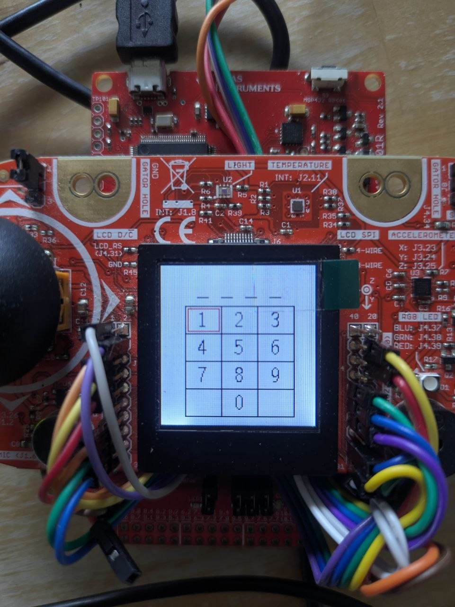
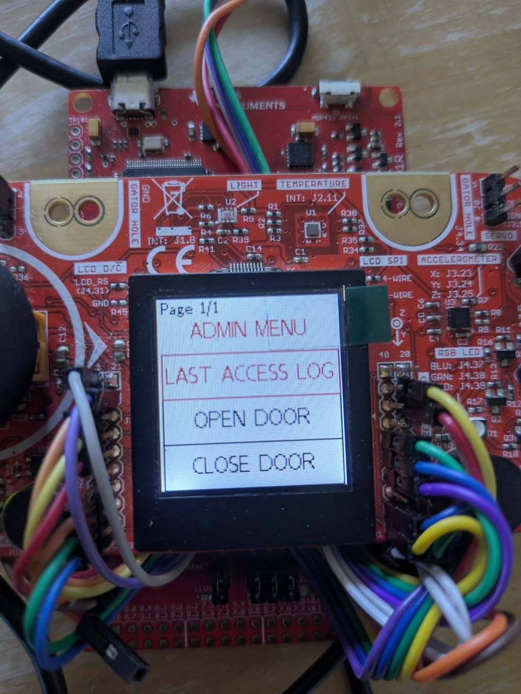
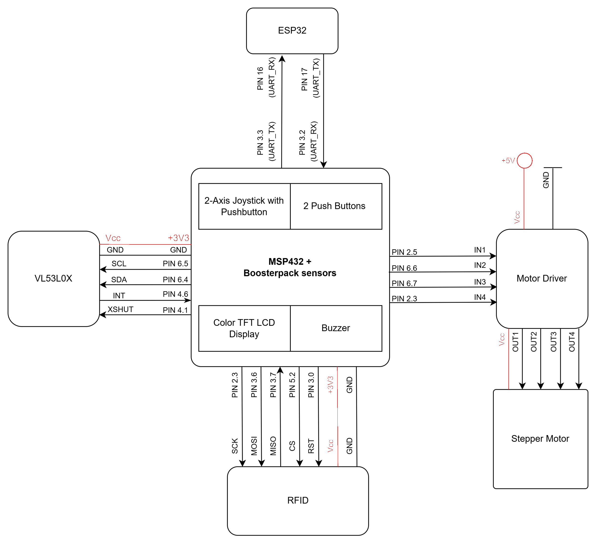
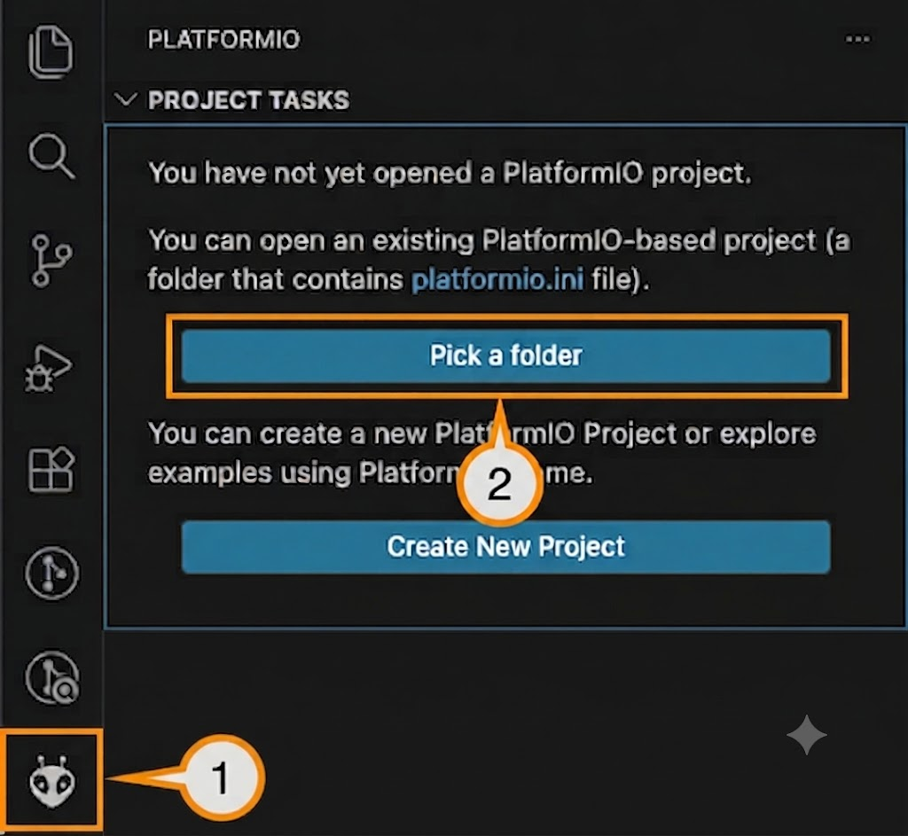
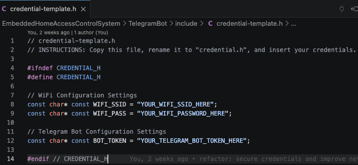
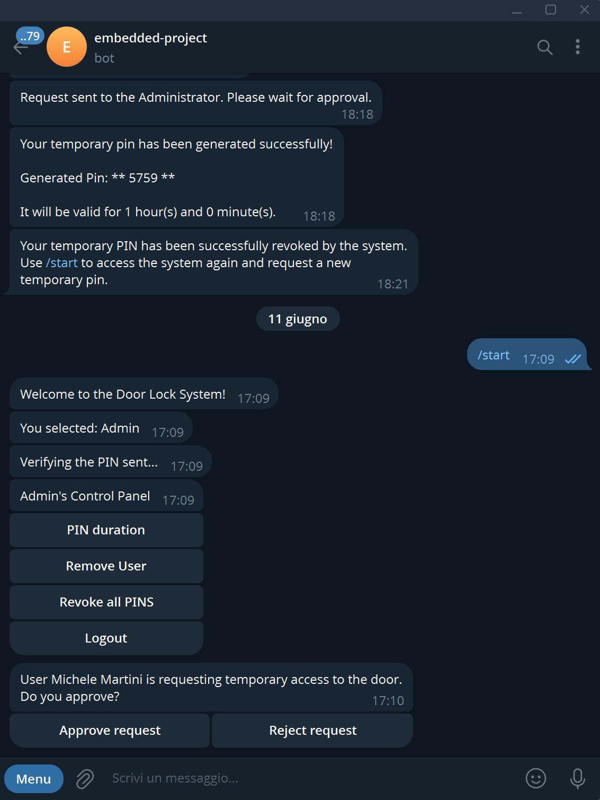

# Home Access Control System 

<!-- TABLE OF CONTENTS -->
<details>
  <summary>Table of Contents</summary>
  <ol>
    <li><a href="#about-the-project">About The Project</a></li>
    <li><a href="#repository-structure">Repository Structure</a></li>
    <li><a href="#hardware-setup">Hardware Setup</a></li>
      <ul>
            <li><a href="#1-rfid-reader">1. RFID Reader</a></li>
            <li><a href="#2-stepper-motor">2. Stepper Motor</a></li>
            <li><a href="#3-display---crystalfontz-128x128-tft-lcd-boostxl-edumkii-onboard">3. Display - Crystalfontz 128x128 TFT LCD (BOOSTXL-EDUMKII Onboard)</a></li>
            <li><a href="#4-input-peripherals-buttons--joystick-boostxl-edumkii-onboard">4. Input Peripherals: Buttons & Joystick (BOOSTXL-EDUMKII Onboard)</a></li>
            <li><a href="#5-piezo-buzzer-boostxl-edumkii-onboard">5. Piezo Buzzer (BOOSTXL-EDUMKII Onboard)</a></li>
            <li><a href="#6-vl53l0x---distance-sensor">6. VL53L0X - Distance Sensor</a></li>
            <li><a href="#7-esp32-s3-uart-communication">7. ESP32-S3 UART Communication</a></li>
            <li><a href="#project-wiring">Project wiring</a></li>
        </ul>
        <li><a href="#software-setup">Software Setup</a>
          <ul>
            <li><a href="#ccstudio-and-simplelink">CCStudio and Simplelink</a></li>
            <li><a href="#telegram-bot">Telegram Bot</a></li>
            <li><a href="#visual-studio-code--platformio">Visual Studio Code + PlatformIO</a></li>
          </ul>
        </li>
      </ul>
    <li><a href="#user-guide">User Guide</a></li>
    <li><a href="#authors">Authors</a></li>
  </ol>
</details>

## About The Project
Welcome to the Home Access Control System!

This project implements a smart door access control system that combines local hardware interaction with IoT remote management.
Users can authenticate using unlock codes, while the administrator can access a dedicated secure menu using an RFID tag.
Beyond the physical interface, an integrated Telegram bot handles remote interactions, enabling the administrator to oversee access permissions and allowing users to request or manage their own codes.
The system also features a database that logs all access events for monitoring purposes.

## Repository Structure

```
.
├── 3D-Model/                          # Hardware 3D printable components
│   ├── All components.3mf             # All components in 1 file
│   ├── door.stl                       # Door model
│   ├── doorframe.3mf                  # Door frame model
│   ├── gear.stl                       # Gear mechanism model
│   ├── sensors_and_peripherals_supports.scad  # OpenSCAD parametric supports
│   └── sensors_and_peripherals_supports.stl   # Exported supports model
├── RepoImages/                        # Documentation media and images
│   ├── HardwareSetup/                 # Schematic diagram
│   ├── SoftwareSetup/                 # Software Setup screenshots
│   │   ├── CCStudio/                  # CCStudio IDE
│   │   ├── FSM/                       # FSM diagram
│   │   └── VSCode+PlatformIO/         # VSCode and PlatformIO IDE
│   └── TelegramBot/                   # Bot usage demonstrations (GIFs & Images)
├── ShortStaysAccessControlSystem/     # Firmware project (MSP432 Microcontroller)
│   ├── msp432p401r.cmd                # Memory linker script
│   ├── src/                           # Source code directory
│   │   ├── external_src/              # External hardware libraries
│   │   │   ├── LCD/                   # Display graphics library
│   │   │   │   ├── Crystalfontz128x128_ST7735.c / .h                     # ST7735 controller primitives
│   │   │   │   └── HAL_MSP_EXP432P401R_Crystalfontz128x128_ST7735.c / .h # Display pin mapping
│   │   │   └── vl53l0x_msp432/        # Distance sensor submodule (Git)
│   │   │       ├── drivers/           # Sensor native API registers
│   │   │       │   ├── config.h       # Timing configuration
│   │   │       │   ├── i2c.c / .h     # I2C driver
│   │   │       │   ├── macro.h        # Internal macros
│   │   │       │   └── vl53l0x.c / .h # Main ranging core
│   │   │       ├── main.c             # Sensor standalone test
│   │   │       └── README.md          # Submodule info
│   │   ├── buzzer.c / .h              # Buzzer acoustic alerts
│   │   ├── comm_esp.c / .h            # Serial communication with ESP32
│   │   ├── database.c / .h            # Local access credentials memory
│   │   ├── display.c / .h             # LCD high-level UI menus
│   │   ├── flash.c / .h               # Flash memory storage driver
│   │   ├── fsm_helpers.c / .h         # State machine utilities
│   │   ├── fsm.c / .h                 # Main application logic (FSM)
│   │   ├── irqHandlers.c / .h         # Hardware interrupt routines
│   │   ├── joystick.c / .h            # Analog joystick driver
│   │   ├── main.c                     # System entry point & loop
│   │   ├── motor.c / .h               # Motor control driver
│   │   ├── push_button.c / .h         # Buttons and debouncing
│   │   ├── sensors.c / .h             # RFID and Distance sensor drivers
│   │   └── timers.c / .h              # Periodic timer configurations
│   ├── startup_msp432p401r_ccs.c      # Microcontroller vector table
│   ├── system_msp432p401r.c           # System clock configuration
│   └── targetConfigs/                 # IDE target configurations
│       ├── MSP432P401R.ccxml          # Target configuration file
│       └── readme.txt                 # Target config info
├── TelegramBot/                       # PlatformIO project (ESP32 Microcontroller)
│   ├── include/                       # Global header files
│   │   ├── credential-template.h      # Wi-Fi and Token template
│   │   └── README.md                  # Folder info
│   ├── lib/                           # Custom local libraries
│   │   ├── DoorBotManager/            # Telegram connection & events logic
│   │   │   ├── DoorBotManager.cpp     # Bot API implementation
│   │   │   └── DoorBotManager.h       # Bot class definition
│   │   └── README.md                  # Lib folder info
│   ├── platformio.ini                 # Build and dependency settings
│   ├── src/                           # Application source code
│   │   ├── idf_component.yml          # ESP-IDF component packages
│   │   └── main.cpp                   # Main bot loop & Wi-Fi init
│   └── test/                          # Unit testing folder
│       └── README.md                  # Test folder info
└── README.md                          # Project documentation
```

## Hardware Setup 

To securely isolate local hardware operations from network tasks, the system architecture is divided between two interconnected microcontrollers:

- **Texas Instruments MSP432P401R**: The core of the system, interfaced with the **Educational BoosterPack MKII (BOOSTXL-EDUMKII)**. It handles several external and onboard sensors and actuators to manage physical access control and user interaction.

- **Espressif ESP32-S3**: Operating as a dedicated network coprocessor, it connects to the MSP to handle all Wi-Fi connectivity, system time synchronization, and the Telegram Bot logic.

Below is the technical breakdown of each hardware module integrated into the system, including their designated communication protocols, pin mapping, and core logic.

### 1. RFID Reader
Handles secure tag scanning and authentication, granting administrator-level access to the local configuration menu.

* **Communication Protocol:** `SPI`
* **Hardware Connections:**
  * `SDA / CS`: Pin `[5.2]`
  * `SCK`: Pin `[3.5]`
  * `MOSI`: Pin `[3.6]`
  * `MISO`: Pin `[3.7]`
  * `RST`: Pin `[3.0]`

#### Core Implementation

##### Initialisation (`RFID_Init`)
```c
Configure SPI pins (SCK, MOSI, MISO, CS, RST) as peripherals
Set CS high (idle)
Pull RST low for 1 ms, then high (hard reset)
Set SPI master: 4 MHz, mode 0, MSB first
Keep SPI module disabled (RFID_ready = false)
```

##### Enable (`RFID_Enable`)
```c
if not RFID_ready:
    RFID_Init()
Enable SPI module
Set RST high, delay 50 ms for boot up

Soft reset MFRC522

Verify version (0x37) == 0x91 or 0x92, if invalid: return false

Configure the onboard timer
Set RxGain
Enable the antenna: set bit0 and bit1 of TxControlReg (0x14)

RFID_ready = true 
return true
```

##### Disable (`RFID_Disable`)
```c
Set CS high
Disable SPI module
Set RST high (inactive)
Restore pins as inputs with pull‑ups (shared with the A_button)
Re‑initialise display and buttons
RFID_ready = false
```

##### Read Tag (`RFID_ReadTag`)
```c
REQA request, if response length < 2 bytes: return false

Anticollision command - multiple cards could be present at the same time. If response length < 5 bytes: return false

Checksum check, if it fails return false

return the UID
```

##### Tag Validation & Error Handling

**Used for standard admin access (in `wait_RFID` or `block_RFID`)**
```c
if not RFID_Enable() show "ERROR" and return false

while true:
    if buttonA_pressed: 
        RFID_Disable(); return false   // cancel (for wait_RFID only)

    if RFID_ReadTag(uid, &len) succeeded:
            if the tag is valid and correct:
	    	show "VALID RFID" and play the correct sound
            	return true
	    else:
		RFID_Disable()
	        show "WRONG RFID", play wrong sound
	        return false
    else:
        delay_ms(50)    // no tag, keep polling after a short delay
```

**Error checks and resilience**:
The RFID driver includes exhaustive checks for every SPI transaction (timeouts, protocol errors, collisions, CRC mismatches, and FIFO emptiness) and validates the UID checksum before accepting a read.
If a critical error occurs (e.g., version mismatch after soft reset), it automatically re‑initialises the module; otherwise, it safely disables the SPI interface and restores pin functions, preventing hangs or bus conflicts.

### 3. Stepper Motor
Actuates the physical locking and unlocking mechanism of the door via precise rotational control.

* **Communication Protocol:** `ULN2003 driver`
* **Hardware Connections:**
  * `IN1`: Pin `[2.5]`
  * `IN2`: Pin `[6.6]`
  * `IN3`: Pin `[6.7]`
  * `IN4`: Pin `[2.3]`

#### Core Features
* **Angle-based Control:** Converts a given angle into the number of steps required by the 28BYJ-48 Stepper Motor. 
* **Safe locking/unlocking Mechanism:** Saving in Flash memory a dedicated flag, ensures protection against two straight opening (or closing) cycles which can damage door mechanism. Pretty useful in case of power failure. 
* **Full-Step Drive:** Supplying power to two coils simultaneously, the Motor gives the maximum available torque and holding force. This ensures reliability when opening/closing the door. 
* **External Power Supply:** To avoid over-heating and self-reset procedure on the MSP-board due to over-current demanding, the Motor Driver is feed with an external 5V Power Source.

#### Core Implementation
```c
moveMotor(int angle):      //This function converts the given angle into the number of steps required and manages motor movement
    calculate number of steps required to turn motor on the given angle    
    
    if the number of steps is negative:
        Motor needs to run counterClockwise
    else:
        Motor runs clockwise

    calculate index for the For-cycle, depending in which direction Motor should run

    for each step Motor will make:

        for each pin:
          
          if the associated coil should go high:
            Set pin high
          else:
            Set pin low
        

        wait before the next step
      

   before returning from the function, set all pins low  
```


### 3. Display - Crystalfontz 128x128 TFT LCD (BOOSTXL-EDUMKII Onboard)


<table width="100%" style="border: none; border-collapse: collapse;">
  <tr style="border: none;">
    <td align="center" width="50%" style="border: none;">
      
    </td>
    <td align="center" width="50%" style="border: none;">
      
    </td>
  </tr>
</table>


The **Crystalfontz CFAF128128B-0145T color 128x128-pixel TFT LCD** renders the local Graphical User Interface (GUI), to display the keypad interface and the admin menu (shown in the pictures above).

* **Communication Protocol:** `SPI`
* **Hardware Connections:**
  * `LCD_SCLK`: Pin `P1.5`
  * `LCD_MOSI`: Pin `P1.6`
  * `LCD_CS`: Pin `P5.0`
  * `LCD_RST`: Pin `P5.7` 
  * `LCD_BACKLIGHT`: Pin `P3.7` 

#### Core UI Features
* **Numeric PIN Grid:** Renders a 3x4 interactive keypad interface for standard user authentication.
* **Administrator Menu:** A scrollable, paginated menu allowing authorized admins to view the last access log and manually lock and unlock the door and clear the database.
* **Dynamic Joystick Navigation:** Translates raw X/Y analog inputs from the joystick to move a red selection rectangle (`Rectangle` struct) across the screen, supporting both grid-based navigation and vertical menu scrolling.
* **Interactive Selection & Feedback:** Evaluates the position of the selection rectangle against a predefined array of coordinates (e.g., `GRID_POINTS`). When a user confirms a selection, the system executes a temporary visual flash (red-to-white fill) over the selected item to provide immediate confirmation feedback.
* **System Status Prompts:** Delivers instant, color-coded visual alerts for real-time events (e.g., `display_door_open()`, `display_wrong_pin()`, `display_block_access()`).

#### Core Implementation

```c
// Initialize the graphics context, display orientation, and default fonts
graphicsInit():
    initialize LCD hardware
    set colors, font and orientation UP

// Routes joystick input to update the UI based on the active screen state
move_rectangle_on_display(x, y, grid_on):
    if grid_on:
        calculate bounds and shift selection box across numeric keypad
    else:
        handle vertical scrolling, pagination, and highlighting in Admin Menu

// Detects selected grid point and triggers visual feedback
number_selected():
    for each point in GRID_POINTS:
        if the point is inside the selection rectangle:
            trigger visual flash feedback
            return point_index        
    return -1    // no number selected

```

### 4. Input Peripherals: Buttons & Joystick (BOOSTXL-EDUMKII Onboard)
Captures analog and digital user inputs for menu navigation, selection, and system interaction. 

* **Communication Protocol:** `GPIO` (Digital Input with Interrupts) & `ADC` (Analog-to-Digital Converter)
* **Hardware Connections:**
  * `Button 1`: Pin `P5.1`
  * `Button 2`: Pin `P3.5`
  * `Joystick X-Axis`: Pin `P6.0`
  * `Joystick Y-Axis`: Pin `P4.4`

#### Core Features
* **Interrupt-Driven Architecture:** Utilizes hardware interrupts for both the ADC (joystick) and GPIO (buttons) to capture inputs asynchronously. This prevents the system from blocking the main execution loop while waiting for user interaction.
* **Pull-Up Configuration:** Pushbuttons are configured with internal pull-up resistors, meaning they trigger on a high-to-low voltage transition (active-low) when pressed.
* **Timer-Based Software Debouncing:** To prevent mechanical switch bounce from registering as multiple rapid presses, the system temporarily disables the button interrupt and triggers a hardware timer. The input state is only validated after the timer expires.

#### Core Implementation
```c
ADC_interrupt():
    if conversion_finished:
        joystick_X = read_ADC(X_channel)
        joystick_Y = read_ADC(Y_channel)
        set move_rectangle_flag       // trigger UI update
        restart joystick_timer

GPIO_button_interrupt():
    if button1_triggered:
        initiate_debounce_sequence()
        return

initiate_debounce_sequence():
    disable button interrupts         // ignore mechanical switch bounce
    start debounce_timer              // wait for signal to stabilize

debounce_timer_interrupt():
    stop debounce_timer

    if button1 is still pressed:
        set button1_pressed_flag
        reset UI_timeout_timer

    if button2 is still pressed:
        set button2_pressed_flag
        reset UI_timeout_timer

    re-enable button interrupts       // ready for next press
```

### 5. Piezo Buzzer

Generates acoustic feedback for successful actions (correct PIN, valid RFID), wrong attempts, and system lockout.
Comes with a configurable VOLUME 
* **Communication Protocol:** `PWM` (Pulse Width Modulation)
* **Hardware Connections:**
  * `Signal`: Pin `P2.7` (Timer_A0 capture/compare output 4)

#### Core Implementation

##### Initialisation (`_buzzerInit`)
```c
Stop Timer_A0
Disable the timer interrupts and clear any pending interrupt flag
Configure P2.7 as peripheral output (primary module function)
```

##### PWM Configuration Structure
```c
Timer_A_PWMConfig {
    clockSource: SMCLK
    clockDivider: 16
    timerPeriod: calculated as a function of the notes
    compareRegister: 4
    outputMode: RESET_SET
    dutyCycle: calculated as a function of the notes
}
```

##### Play a Song (`buzzerPWMgen`)
```c
For each note in the song:
    if volume != 0 and freq != 0:
        timerPeriod = ((SMCLK frequency) / (freq × 16)) & (0xFFFF) // clamped to 16‑bit]
        dutyCycle = (timerPeriod × volume) >> 10
        Configure and start PWM with this period/duty
        delay for the note.duration
        dutyCycle = 0 → stop PWM
        delay_ms(1)   // short silence between notes
    else:
        Stop timer (no sound)
```
All sequences are blocking (delay-based) and play to completion before returning control to the caller.

##### Pre‑defined Sounds

| Sound         |
|---------------|
| `CorrectPin`  |
| `WrongPin`    |
| `LockOut`     |
| `CorrectRFID` |

### 6. VL53L0X - Distance Sensor
Detects user proximity to wake the system from low‑power mode, configured to trigger an interrupt when a target is closer than 300 mm (src/external_src/vl53l0x_msp432/drivers/config.h).

* **Communication Protocol:** `I²C`
* **Hardware Connections:**
  * `SCL`: Pin `P6.5`
  * `SDA`: Pin `P6.4`
  * `XSHUT`: Pin `P4.1` (hardware reset / power enable)
  * `INTERRUPT`: Pin `P4.6` (active‑low)

#### Core Implementation

##### Initialisation (`ToF_Init`)
```c
Configure XSHUT as output, pull low (sensor in reset)
Initialise I²C master (EUSCI_B1, speed: 400 kHz, clk source: SMCLK)
Configure interrupt pin as input with pull‑up, edge‑triggered (falling edge)
```

##### Enable (`ToF_enable`)
```c
Release XSHUT (high) and wait for sensor boot
vl53l0x_init():
    - I²C slave address set to default address (0x29)
    - load SPAD configuration from NVM
    - Load default tuning settings
    - Set signal rate limit (0.25 MCPS) and timing budget (33 ms) for average light conditions
    - Run VHV and phase calibrations

Call vl53l0x_start_continuous(): arms continuous back‑to‑back ranging

Clear any pending interrupt on sensor

Enable GPIO interrupt on P4.6

ToF_ready = true
```

##### Disable (`ToF_disable`)
```c
Disable GPIO interrupt on P4.6

Call vl53l0x_stop_continuous() halts the ranging engine and clears interrupt register

Pull XSHUT low (sensor in hardware standby)

ToF_ready = false
ToF_flag = 0
```

##### Interrupt Handling (`ToF_IRQHandler`)
```c
Disable further interrupts on P4.6
Clear interrupt flag on GPIO

If ToF_ready: set ToF_flag = 1
```

##### Proximity Detection Flow
System in `STATE_AOD` with sensor enabled

User approaches, sensor crosses 300 mm threshold and INT pin asserts

`ToF_flag` set so `check_for_inputs()` evaluates the ToF reading via `vl53l0x_read_range_interrupt()`

If range ≤ low_threshold && the error code is valid:
	 disable the sensor and wake system to `STATE_INSERT_PIN`
   else:
	reactivate the interrupt for ToF and go to sleep

#### Error checks and resilience
The VL53L0X driver implements automatic init retries (up to 2 attempts) if initialisation or continuous ranging start fails. 
Every I2C transaction includes NACK detection and timeout checks to prevent hanging or corrupted configuration in registers I/O operations.


### 7. ESP32-S3 UART Communication

An `UART` serial communication interface was configured to enable data exchange and command execution between the two microcontrollers.

* **Communication Protocol:** `UART`

* **Hardware Connections:**
  * Texas Instruments MSP432P401R:
    * TX: Pin `P3.3`
    * RX: Pin `P3.2`
  * Espressif ESP32-S3:
    * TX: Pin `P17`
    * RX: Pin `P16`

#### Core Features

* **Message Handling & Dispatching:** Uses hardware interrupts (`EUSCIA2_IRQHandler`) to asynchronously buffer incoming messages and routes them to specific handlers based on predefined prefixes (`processUartMessage`).


* **PIN Management:** Manages access by generating unique 4-digit PINs (`handleGenTempPin`), verifying user inputs against stored credentials (`handleVerifyPin`), and processing early revocation requests (`handleRevokePin`).


* **Time Synchronization:** Requests network time (`requestRealTime`) and parses the ESP32 payload to accurately configure the hardware Real-Time Clock (`handleTimeSync`).

### Project wiring


## Software Setup


### CCStudio and Simplelink

1. First, clone the repository with git

```bash
git clone <repository-url>
cd <repository-folder>
git submodule init && git submodule update --remote
```

2. Then download [**CCStudio v12.8**](https://www.ti.com/tool/download/CCSTUDIO/12.8.1) and [**SimpleLink MSP432 SDK v3.40.01.02**](https://www.ti.com/tool/download/SIMPLELINK-MSP432-SDK/3.40.01.02)

> ⚠️ **Important:** The SimpleLink SDK must be placed in the **parent directory** of the repository (i.e., the folder that will contain the cloned repo). For example, if you pln
 to clone into `~/my_project`, the SDK should be extracted to `~/` (so the SDK folder sits alongside `my_project`, not inside it).


3. Now you can import the project in CCStudio:
    - Launch **CCStudio v12.8**
    - When prompted for a workspace, select the **repository folder** (the one you just cloned)
    - Go to **Project → Import Project** (or **File → Import** → **CCS Projects**)
    - Click **Browse…** and select the repository folder
    - Under **Discovered Projects**, check the project you want to import
    - Click **Finish**

4. The MSP432 program can be now uploaded to the board.

### Telegram Bot

1. Download and install Telegram on your device. We recommend using the [Telegram Desktop application](https://desktop.telegram.org/) on your PC for a more comfortable setup experience.
Open this link [**@BotFather**](https://t.me/BotFather) to launch the official bot creation tool in Telegram, then start the conversation by sending the command `/start`.
3. Send the command `/newbot` to create a new bot.
4. Follow **@BotFather**'s instructions to configure your bot:
   * First, choose a **name** for your bot (this is the display name users will see).
   * Then, choose a unique **username** (it must end with `bot`, e.g., `HomeAccess_bot`).
5. Once the bot is created, BotFather will send you a confirmation message containing your **HTTP API Token**. Copy and save this token securely, as you will need to insert it into the project file for the ESP firmware, as explained in the following section.
6. To configure the bot's menu, send the command `/setcommands` to **@BotFather**.
7. Select your newly created bot from the provided list, then copy and paste the following text into the chat to set up your commands:

```
start - Initialize the bot and authenticate yourself
menu - Display the main control panel and available features
cancel - Abort the current operation or transaction
```

### Visual Studio Code + PlatformIO

1. Download and install [Visual Studio Code](https://code.visualstudio.com/download).
2. Install the [PlatformIO IDE Extension](https://docs.platformio.org/en/latest/what-is-platformio.html) from the VSCode extensions marketplace.

<p align="center">
  
</p> 

3. Click the PlatformIO icon on the left sidebar. You will see the screen shown in the image below. Click the **Pick a folder** button. Navigate to the location where you cloned the `HomeAccessControlSystem` repository and select the `TelegramBot` folder inside it to open the project.

<p align="center">
  
</p> 

4. Open the configuration file located at `TelegramBot/include/credential-template.h` starting from the root of the repository.

5. Insert your Wi-Fi credentials and the Telegram Bot token you saved earlier by replacing the placeholder text inside the quotes "":

<p align="center">
  
</p> 

6. Copy and rename the file from `credential-template.h` to `credential.h`. This ensures your sensitive credentials are not accidentally uploaded to GitHub if you push your changes, as `credential.h` is already included in the `TelegramBot` project's `.gitignore` file.

7. Connect a microUSB cable to the **UART** port on your **ESP32-S3 board**. Go to the top right corner where the **Build** icon (the checkmark) is located, click the down arrow symbol next to it, and select **Upload** to compile the code and upload the firmware.

> **Note:** The first time you perform this action, it will take some time. PlatformIO works in the background to automatically download all the necessary libraries and the updated Arduino core directly from the official Espressif repository.

## User Guide

QUI link al video e alla presentazione

SCRIPT:
Commentare quello che si vede nel video
Contenuti del video:
- Intro: spiegazione del problema
- Spiegazione lato MSP:
  - admin accede al menu, usa rfid e mostra database (con accessi già presenti)
- IoT:
  - accesso admin al bot telegram, si mostra il menù
  - User richiede un pin
  - Admin accetta il pin
  - User inserisce il pin corretto, apertura porta
  - refresh dell'MSP e nuovo tentativo di accesso con vecchio pin user
  - User verifica durata rimasta del pin e poi se lo revoca autonomamente
  - User inserisce il pin sbagliato, buzzer
  - Admin rimuove tutti i pin

### System Interface

#### 1. Database

When logged as Admin, the system allows you to see and to navigate through an interactive “Log Database”, which stores in permanent memory (Flash) the last 10 autentication data remembering the the moment of the access, the used PIN and if it has been recognised as the Admin one, as one of the Users or none.  

##### Core features

* **Interactive Navigation:** Using the on-board joystick, the Admin can browse the different Database pages containing all log data.

* **Quick Save:** During initialization instructions, info stored in Flash memory are copied in a RAM instance to be modified and to be shown. When a new log event is added, the systems quickly upload these modifications in the permanent memory ensuring any data lost due to power faults.

* **Blocked User Access:** The Home Access Control System checks when User access is denied multiple times, blocking it when a maximum number of tries is exceeded, until the Admin uses his RFID tag. To prevent an intruder from bypassing this check, a Boolean flag is stored in Flash memory with Database data so the system can remember, in case it’s turned off, that the Admin action is required to proceed with normal activities.

### Telegram Bot Interface

- First of all, search for your bot in Telegram using the **@username** you assigned to it during the BotFather setup (refer to the previous **Software setup section**).
- Now, you can initiate the conversation by pressing the **Start** button at the bottom of the chat or by typing the `/start` command. You will receive a prompt asking you to authenticate as either an **Admin** or a **User**.
- If you choose to log in as an **Admin**, the bot will ask for an unlock code. Currently, this code is hardcoded as `9999`.

- Once authenticated, the main command dashboard will appear. You can always bring up this dashboard again at any time by sending the `/menu` command (this applies to both Admin and Users).

<p align="center">
  
</p> 

**Admin Features**
When logged in as an Admin, your dashboard will include the following functions:
1. `Pin Duration`: Set the validity time limit for the temporary pins granted to Users.

<p align="center">
  
</p> 

2. `Remove User`: Remove a specific User entirely from the system.

<p align="center">
  
</p>

3. `Revoke all PINS`: Revoke all currently active unlock pins for all users in the system.

Beyond the dashboard, the main Admin's feature is receiving direct notifications to either approve or deny user pin requests.

<p align="center">
  
</p>

**User Features**
When logged in as a User, your dashboard adapts based on your current access status:
1. `Request Temporary Pin`: After the authentication, this is the only available action. Use it to send an access pin request to the Admin.

<p align="center">
  
</p>

2. `Temporary Pin Duration`: Once the Admin grants you a pin, use this button to check how much validity time is left before it expires.

<p align="center">
  
</p>

3. `Revoke Temporary Pin`: If you no longer need access, use this to manually revoke your own active pin early.

<p align="center">
  
</p>

## Authors

- Pietro Baroni:
  1. MSP432 FSM structure
  2. Display API and menus
  3. Joystick ADC
  4. Push buttons

- Michele Martini:
  1. Telegram bot
  2. ESP32 FSM
  3. UART Communication

- Michele Casagrande:
  1. Flash I/O operations
  2. Database API
  3. Stepper motor integration

- Alessandro Biasioli
  1. RFID setup, logic and communication
  2. ToF Sensor bare-metal driver and logic
  3. Buzzer 
  4. MCU sleep and AoD logic
