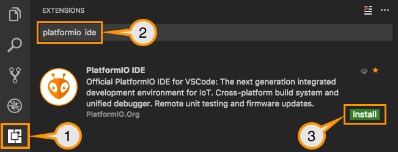

# Home Access Control System 

<!-- TABLE OF CONTENTS -->
<details>
  <summary>Table of Contents</summary>
  <ol>
    <li><a href="#about-the-project">About The Project</a></li>
    <li><a href="#repository-structure">Repository Structure</a></li>
    <li>
      <a href="#requirements">Requirements</a>
      <ul>
        <li><a href="#hardware-setup">Hardware Setup</a></li>
      </ul>
      <ul>
        <li><a href="#software-setup">Software Setup</a>
          <ul>
            <li><a href="#ccstudio">CCStudio</a></li>
            <li><a href="#telegram-bot">Telegram Bot</a></li>
            <li><a href="#visual-studio-code--platformio">Visual Studio Code + PlatformIO</a></li>
          </ul>
        </li>
      </ul>
    </li>
    <li><a href="#authors">Authors</a></li>
  </ol>
</details>

## About The Project
Welcome to the Home Access Control System!

This project implements a smart door access control system that combines local hardware interaction with IoT remote management.
Users can authenticate using unlock codes, while the administrator can access a dedicated secure menu using an RFID tag.
Beyond the physical interface, an integrated Telegram bot handles remote interactions, enabling the administrator to oversee access permissions and allowing users to request or manage their own codes.
The system also features a database that logs all access events for monitoring purposes.

The architecture is split between two microcontrollers to safely separate local hardware logic from network tasks:
- **MSP432P401R**: Acts as the brain for local operations, handling sensor inputs, the user interface, and mechanical outputs.
- **ESP32-S3**: Connected to the MSP, this board is dedicated to WiFi connectivity, fetching the clock time, and handling the Telegram Bot logic.


## Repository Structure

```
.
├── ShortStaysAccessControlSystem/     # Firmware project (MSP432 Microcontroller)
│   ├── msp432p401r.cmd                # Memory linker script
│   ├── src/                           # Source code directory
│   │   ├── external_src/              # External hardware libraries
│   │   │   └── vl53l0x_msp432/        # Distance sensor submodule (Git)
│   │   │       ├── drivers/           # Sensor native API registers
│   │   │       │   ├── config.h       # Timing configuration
│   │   │       │   ├── i2c.c / .h     # I2C driver
│   │   │       │   ├── macro.h        # Internal macros
│   │   │       │   └── vl53l0x.c / .h # Main ranging core
│   │   │       ├── main.c             # Sensor standalone test
│   │   │       └── README.md          # Submodule info
│   │   ├── LcdDriver/                 # Display graphics library
│   │   │   ├── Crystalfontz128x128_ST7735.c / .h                       # ST7735 controller primitives
│   │   │   └── HAL_MSP_EXP432P401R_Crystalfontz128x128_ST7735.c / .h   # Display pin mapping
│   │   ├── buzzer.c / .h              # Buzzer acoustic alerts
│   │   ├── comm_esp.c / .h            # Serial communication with ESP32
│   │   ├── database.c / .h            # Local access credentials memory
│   │   ├── display.c / .h             # LCD high-level UI menus
│   │   ├── fsm_helpers.c / .h         # State machine utilities
│   │   ├── fsm.c / .h                 # Main application logic (FSM)
│   │   ├── irqHandlers.c / .h         # Hardware interrupt routines
│   │   ├── joystick.c / .h            # Analog joystick driver
│   │   ├── main.c                     # System entry point & loop
│   │   ├── push_button.c / .h         # Buttons and debouncing
│   │   ├── sensors.c / .h             # Sensors hardware data polling
│   │   └── timers.c / .h              # Periodic timer configurations
│   ├── startup_msp432p401r_ccs.c      # Microcontroller vector table
│   └── system_msp432p401r.c           # System clock configuration
├── TelegramBot/                       # PlatformIO project (ESP32 Microcontroller)
│   ├── include/                       # Global header headers
│   │   └── README                     # Folder info
│   ├── lib/                           # Custom local libraries
│   │   ├── DoorBotManager/            # Telegram connection & events logic
│   │   │   ├── DoorBotManager.cpp     # Bot API implementation
│   │   │   └── DoorBotManager.h       # Bot class definition
│   │   └── README                     # Lib folder info
│   ├── platformio.ini                 # Build and dependency settings
│   ├── src/                           # Application source code
│   │   ├── idf_component.yml          # ESP-IDF component packages
│   │   ├── main.cpp                   # Main bot loop & Wi-Fi init
│   │   └── mainTest.txt               # Text test file
│   └── test/                          # Unit testing folder
│       └── README                     # Test folder info
└── README.md                          # Project documentation
```

## Requirements

### Hardware Setup (+ Project wiring) (Pietro)
You will need a Texas Instrument MSP432P401R along with its expansion board: the BOOSTXL-EDUMKII. 

The system integrates the following components and sensors:
- **RFID**: Scans tags to allow the administrator to access the local admin menu.
- **Stepper Motor**: Controls the physical opening and closing mechanism of the door.
- **Display**: Renders the local user interface.
- **Buttons and Joystick**: Allow users to navigate through the system interface.
- **Buzzer**: Provides acoustic feedback, such as warning signals for incorrect code inputs and general alerts.
- **ToF sensor**: 

Cosa scrivere: protocollo di comunicazione, pin utilizzati, funzioni significative.

  (Basic Project wiring: schema con tutti i pin, come in questo schema)


### Software Setup (CCSTudio + PlatformIO) (Alessandro)

Follow these steps to configure your environment and upload the firmwares on the boards.

#### CCStudio


#### Telegram Bot

1. Download and install Telegram on your device. We recommend using the [Telegram Desktop application](https://desktop.telegram.org/) on your PC for a more comfortable setup experience.
Open this link [**@BotFather**](https://t.me/BotFather) to launch the official bot creation tool in Telegram, then start the conversation by sending the command `/start`.
3. Send the command `/newbot` to create a new bot.
4. Follow **@BotFather**'s instructions to configure your bot:
   * First, choose a **name** for your bot (this is the display name users will see).
   * Then, choose a unique **username** (it must end with `bot`, e.g., `HomeAccess_bot`).
5. Once the bot is created, BotFather will send you a confirmation message containing your **HTTP API Token**. Copy and save this token securely, as you will need to insert it into the project file for the ESP firmware, as explained in the following section.
6. To configure the bot's menu, send the command `/setcommands` to **@BotFather**.
7. Select your newly created bot from the provided list, then copy and paste the following text into the chat to set up your commands:

```
start - Initialize the bot and authenticate yourself
menu - Display the main control panel and available features
cancel - Abort the current operation or transaction
```

#### Visual Studio Code + PlatformIO

1. Download and install [Visual Studio Code](https://code.visualstudio.com/download).
2. Install the [PlatformIO IDE Extension](https://docs.platformio.org/en/latest/what-is-platformio.html) from the VSCode extensions marketplace.

<p align="center">
  
</p> 

3. Click the PlatformIO icon on the left sidebar. You will see the screen shown in the image below. Click the **Pick a folder** button. Navigate to the location where you cloned the `EmbeddedHomeAccessControlSystem` repository and select the `TelegramBot` folder inside it to open the project.

<p align="center">
  
</p> 

4. Open the configuration file located at `TelegramBot/include/credential-template.h` starting from the root of the repository.

5. Insert your Wi-Fi credentials and the Telegram Bot token you saved earlier by replacing the placeholder text inside the quotes "":

<p align="center">
  
</p> 

6. Copy and rename the file from `credential-template.h` to `credential.h`. This ensures your sensitive credentials are not accidentally uploaded to GitHub if you push your changes, as `credential.h` is already included in the `TelegramBot` project's `.gitignore file`.

7. Connect a microUSB cable to the **UART** port on your **ESP32-S3 board**. Go to the top right corner where the **Build** icon (the checkmark) is located, click the down arrow symbol next to it, and select **Upload** to compile the code and upload the firmware.

> **Note:** The first time you perform this action, it will take some time. PlatformIO works in the background to automatically download all the necessary libraries and the updated Arduino core directly from the official Espressif repository.

## User Guide + Youtube Video and PowerPoint

link al video e alla presentazione?

SCRIPT:
Commentare quello che si vede nel video
Contenuti del video:
- Intro: spiegazione del problema
- Spiegazione lato MSP:
  - admin accede al menu, usa rfid e mostra database (con accessi già presenti)
- IoT:
  - accesso admin al bot telegram, si mostra il menù
  - User richiede un pin
  - Admin accetta il pin
  - User inserisce il pin corretto, apertura porta
  - refresh dell'MSP e nuovo tentativo di accesso con vecchio pin user
  - User verifica durata rimasta del pin e poi se lo revoca autonomamente
  - User inserisce il pin sbagliato, buzzer
  - Admin rimuove tutti i pin

### System Interface

spiegare funzioni lato MSP qui

### Telegram Bot Interface

- First of all, search for your bot in Telegram using the **@username** you assigned to it during the BotFather setup (refer to the previous **Software setup section**).
- Now, you can initiate the conversation by pressing the **Start** button at the bottom of the chat or by typing the `/start` command. You will receive a prompt asking you to authenticate as either an **Admin** or a **User**.
- If you choose to log in as an **Admin**, the bot will ask for an unlock code. Currently, this code is hardcoded as `9999`.

- Once authenticated, the main command dashboard will appear. You can always bring up this dashboard again at any time by sending the `/menu` command (this applies to both Admin and Users).

<p align="center">
  
</p> 

**Admin Features**
When logged in as an Admin, your dashboard will include the following functions:
1. `Pin Duration`: Set the validity time limit for the temporary pins granted to Users.

<p align="center">
  
</p> 

2. `Remove User`: Remove a specific User entirely from the system.

<p align="center">
  
</p>

3. `Revoke all PINS`: Revoke all currently active unlock pins for all users in the system.

Beyond the dashboard, the main Admin's feature is receiving direct notifications to either approve or deny user pin requests.

<p align="center">
  
</p>

**User Features**
When logged in as a User, your dashboard adapts based on your current access status:
1. `Request Temporary Pin`: After the authentication, this is the only available action. Use it to send an access pin request to the Admin.

<p align="center">
  
</p>

2. `Temporary Pin Duration`: Once the Admin grants you a pin, use this button to check how much validity time is left before it expires.

<p align="center">
  
</p>

3. `Revoke Temporary Pin`: If you no longer need access, use this to manually revoke your own active pin early.

<p align="center">
  
</p>

## Authors

- Pietro Baroni:
  1. Display
  2. Joystick and push buttons

- Michele Martini:
  1. Telegram bot
  2. UART Communication

- Michele Casagrande:
  1. Database
  2. Motor

- Alessandro Biasoli
  1. RFID
  2. ToF Sensor
  3. Buzzer
  
---

# EmbeddedProject
Access control for door opening in short stays

## Sensors

- (Biasio) ultrasound sensor for proximity when in front of the board to lit the display or (PIR sensor)
- RFID sensor for admin magnetic access
- Servo motor for opening/closing the door
- (Pietro) Joystick for menu navigation
- (Pietro) Buttons and joystick for menu navigation
- Leds for signal
- (Mich M) Wifi module for IoT connectivity via telegram Bot and clock time
- Hand clap sequence for opening
- (Biasio) Buzzer for wrong code input and in general for signaling

## Features

### 
- (Biasio) Sleep mode with AOD, while proximity sensor doesn't trigger
- First time initialization of the code.
- RFID access displays the menu for pincode setup, wifi setup, enable/disable rfid, factory reset.
- (Mich M) Wifi connection via WPS or via file. [ UART PINS -> MSP(RX = J1.3 , TX = J1.4 ) ; ESP32(RX = 16 , TX = 17 ) ]
- (Mich C) Database of access and access attempts.
- 2 pin codes, one for admin log in and one for user log in.
- Too  many wrong attempts blocks the pin access for some time, too many wrong-blocking timed attempts trigger an admin block.
  
### TELEGRAM BOT
#### USER side
- Request temporary code access for the time of the stay
- Shows how much time is left before the PIN expires

#### ADMIN side
- Approve code request from clients
- Admin receives attempts access notifications and can view access logs (NOT IMPLEMENTED)
- Remove an user from the system
- Revoke all active pins and remove the corresponding user from the system
- Set the duration of temporary pins


## Prerequisites

### Software
Ensure you have the following installed before cloning:
* **[Git LFS](https://git-lfs.com/)**: Required. We use Large File Storage to track the SIMPLELINK SDK libraries.
* **Code Composer Studio (CCS) v12.8**.

### Hardware:
* **TexasInstruments' MSP-EXP432P401R Board**
* **Texas Instruments' BoosterPack BOOSTXL-EDUMKII**

## Getting Started

Follow these steps to build the project:
clone the sdk: simplelink_msp432p4_sdk_3_40_01_02](https://www.ti.com/tool/download/SIMPLELINK-MSP432-SDK/3.40.01.02
### 1. Clone the Repository
Because we use Git LFS, make sure LFS is initialized on your machine before cloning:
```bash
git lfs install
git clone <your-repository-url>
cd <your-repository-name>


### 2. Import the project in CCStudio
1. The git repo is a full workspace for ccstudio, so when opening the IDE select the cloned folder as the active workspace. 
2. The project should be already configured and working out of the box; if no project is automatically imported do "Import Project > Code Composer Studio > CCS Projects > Browse... > Select the ShortStaysAccessControlSystem folder inside the repo location > tick the ccs project > click Finish "
```
